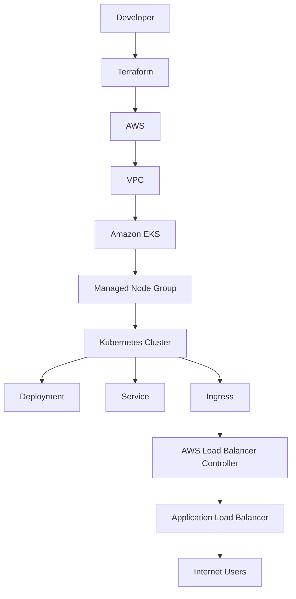

# pre-aws-infra

# AWS EKS Two-Tier Application Deployment using Terraform

Deploy a production-ready Amazon Elastic Kubernetes Service (EKS) cluster using Terraform and host a two-tier application on Kubernetes with AWS Application Load Balancer (ALB) Ingress.

This project demonstrates Infrastructure as Code (IaC), Kubernetes orchestration, AWS networking, IAM integration, and production deployment practices commonly used by Platform Engineering and DevOps teams.

---

## Project Overview

This project provisions a complete Kubernetes platform on Amazon EKS using Terraform. The infrastructure is deployed entirely through Infrastructure as Code (IaC), enabling consistent, repeatable, and version-controlled deployments without manual configuration.

After provisioning the infrastructure, a sample two-tier application is deployed to the EKS cluster using Kubernetes manifests. The application is exposed externally through the AWS Load Balancer Controller, which automatically provisions an AWS Application Load Balancer (ALB) based on the Kubernetes Ingress resource.

The project demonstrates the end-to-end workflow of provisioning cloud infrastructure, configuring Kubernetes, deploying applications, and exposing services securely using AWS-native integrations.

### Key Objectives

- Provision AWS infrastructure using Terraform
- Deploy and manage an Amazon EKS cluster
- Configure AWS networking components
- Implement IAM Roles for Service Accounts (IRSA)
- Deploy a containerized application on Kubernetes
- Expose the application using AWS ALB Ingress
- Store Terraform state remotely using Amazon S3 and DynamoDB
- Follow infrastructure organization aligned with production environments

> **Note:** This project focuses on infrastructure provisioning and Kubernetes deployment. The application used is intentionally simple to emphasize the platform engineering aspects of the solution.

## Solution Architecture

The following diagram illustrates the high-level architecture of the solution, showing how Terraform provisions the AWS infrastructure and how Kubernetes resources interact to expose the application through an AWS Application Load Balancer.



### Architecture Workflow

The deployment follows the sequence below:

1. Terraform provisions the AWS infrastructure, including the VPC, networking components, IAM resources, and the Amazon EKS cluster.
2. Managed worker nodes join the EKS cluster and become available for scheduling workloads.
3. Kubernetes manifests deploy the application as a Deployment and expose it internally using a Service.
4. An Ingress resource is created to expose the application externally.
5. The AWS Load Balancer Controller detects the Ingress resource and automatically provisions an Application Load Balancer (ALB).
6. External users access the application through the ALB, which routes traffic to the Kubernetes Service and ultimately to the application Pods.

### Architecture Components

| Component | Purpose |
|-----------|---------|
| Terraform | Provisions AWS infrastructure using Infrastructure as Code (IaC). |
| Amazon VPC | Provides network isolation for the EKS cluster. |
| Public Subnets | Separate internet-facing resources from worker nodes. |
| Internet Gateway | Enables internet connectivity for public resources. |
| Amazon EKS | Managed Kubernetes control plane. |
| Managed Node Group | Provides EC2 worker nodes to run Kubernetes workloads. |
| IAM Roles & OIDC | Enables secure authentication between Kubernetes service accounts and AWS services using IRSA. |
| Kubernetes Deployment | Manages application Pods and desired state. |
| Kubernetes Service | Exposes Pods internally within the cluster. |
| Kubernetes Ingress | Defines external routing rules for the application. |
| AWS Load Balancer Controller | Automatically provisions an ALB based on Kubernetes Ingress resources. |
| Application Load Balancer | Routes external HTTP/HTTPS traffic to the application running inside Kubernetes. |

## Technology Stack

The project leverages the following technologies to provision infrastructure, deploy applications, and manage Kubernetes resources.

| Category | Technology | Purpose |
|----------|------------|---------|
| Infrastructure as Code | Terraform | Provisions and manages AWS infrastructure in a declarative manner. |
| Cloud Platform | Amazon Web Services (AWS) | Provides the cloud infrastructure required to host the Kubernetes platform. |
| Container Orchestration | Amazon EKS | Managed Kubernetes service used to deploy and manage containerized workloads. |
| Container Runtime | Docker | Packages the application into portable container images. |
| Cluster Management | Kubernetes | Orchestrates application deployment, scaling, networking, and lifecycle management. |
| Networking | Amazon VPC | Provides network isolation and connectivity for the EKS cluster. |
| Load Balancing | AWS Application Load Balancer (ALB) | Exposes the application securely to external users. |
| Ingress Controller | AWS Load Balancer Controller | Automatically provisions and manages ALBs from Kubernetes Ingress resources. |
| Authentication | IAM & IRSA | Enables secure access between Kubernetes workloads and AWS services without static credentials. |
| State Management | Amazon S3 | Stores the remote Terraform state file. |
| State Locking | Amazon DynamoDB | Prevents concurrent Terraform operations by providing state locking. |
| Command Line Tools | AWS CLI, kubectl | Used to provision, configure, and manage AWS resources and Kubernetes clusters. |

### Why These Technologies?

This project uses a combination of industry-standard DevOps tools to demonstrate modern cloud infrastructure provisioning and Kubernetes platform management.

- **Terraform** enables repeatable and version-controlled infrastructure deployments.
- **Amazon EKS** eliminates the operational overhead of managing the Kubernetes control plane.
- **Docker** ensures applications are packaged consistently across environments.
- **AWS Load Balancer Controller** provides native integration between Kubernetes Ingress resources and AWS Application Load Balancers.
- **Amazon S3** and **DynamoDB** provide secure remote state storage and locking for collaborative Terraform workflows.
- **IAM Roles for Service Accounts (IRSA)** follows AWS security best practices by eliminating the need to store long-lived AWS credentials inside containers.

  ## AWS Services Used

The following AWS services are provisioned and configured as part of this project.

| AWS Service | Purpose |
|-------------|---------|
| Amazon VPC | Provides an isolated virtual network for the Kubernetes cluster. |
| Public Subnets | Host the EKS worker nodes and internet-facing resources. |
| Internet Gateway | Enables internet connectivity for resources within the VPC. |
| Route Tables | Control network traffic routing within the VPC. |
| Security Groups | Act as virtual firewalls to control inbound and outbound traffic. |
| Amazon EKS | Provides the managed Kubernetes control plane. |
| EC2 Managed Node Group | Hosts the Kubernetes worker nodes that run application workloads. |
| IAM | Creates roles and policies required by the EKS cluster, worker nodes, and AWS Load Balancer Controller. |
| IAM OIDC Provider | Enables IAM Roles for Service Accounts (IRSA) for secure AWS service access from Kubernetes workloads. |
| Application Load Balancer (ALB) | Routes external HTTP/HTTPS traffic to the Kubernetes application. |
| Amazon S3 | Stores the remote Terraform state file. |
| Amazon DynamoDB | Provides state locking to prevent concurrent Terraform operations. |

### Infrastructure Provisioning Summary

Terraform provisions all core AWS infrastructure required to host the Kubernetes platform, including networking, identity and access management, and the Amazon EKS cluster.

The AWS Load Balancer Controller is installed within the Kubernetes cluster and dynamically provisions an Application Load Balancer (ALB) whenever a Kubernetes Ingress resource is created.

This separation of responsibilities keeps Terraform focused on infrastructure provisioning while allowing Kubernetes to manage application-specific resources.

### Responsibility Split

| Managed By Terraform | Managed By Kubernetes |
|----------------------|-----------------------|
| VPC | Deployment |
| Public Subnets | Service |
| Internet Gateway | Ingress |
| Route Tables | Pods |
| Security Groups | ReplicaSets |
| IAM Roles | Namespaces |
| OIDC Provider | ConfigMaps |
| Amazon EKS Cluster | Secrets |
| Managed Node Group | Application Load Balancer (via AWS Load Balancer Controller) |
| S3 Backend | |
| DynamoDB Lock Table | |

## Repository Structure

The repository is organized to separate infrastructure components into logical Terraform configuration files. This modular structure improves readability, maintainability, and scalability.

```text
terraform/
├── backend.tf                 # Remote backend configuration (S3 & DynamoDB)
├── provider.tf                # AWS provider configuration
├── versions.tf                # Terraform and provider version constraints
├── variables.tf               # Input variable definitions
├── terraform.tfvars           # Environment-specific variable values
├── main.tf                    # Common Terraform configuration
├── vpc.tf                     # VPC, subnets, route tables, and networking
├── eks.tf                     # Amazon EKS cluster and managed node group
├── iam.tf                     # IAM roles and policies
├── oidc.tf                    # IAM OIDC provider configuration
├── alb-irsa.tf                # IAM Role for Service Account (AWS Load Balancer Controller)
├── security-groups.tf         # Security Group definitions
├── locals.tf                  # Local values
├── outputs.tf                 # Terraform outputs
└── policies/                  # Custom IAM policy documents
```
### Why This Structure?

Instead of placing all resources into a single Terraform file, the infrastructure is organized by responsibility. This modular approach offers several benefits:

- Improves readability by grouping related resources.
- Simplifies troubleshooting and future enhancements.
- Encourages code reuse and easier collaboration.
- Aligns with Infrastructure as Code (IaC) best practices followed in production environments.
